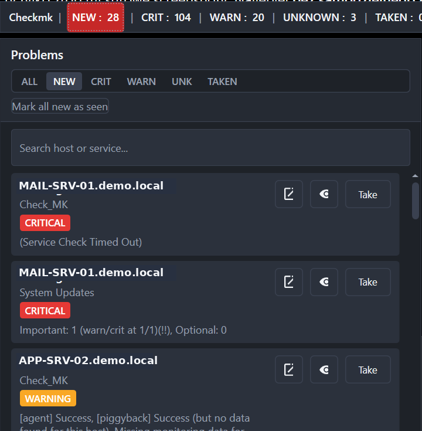
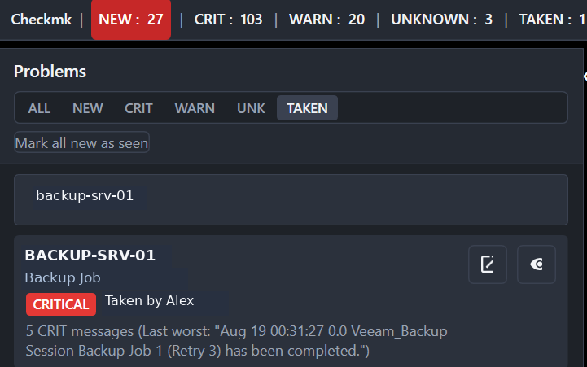
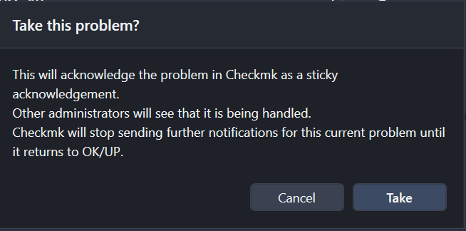
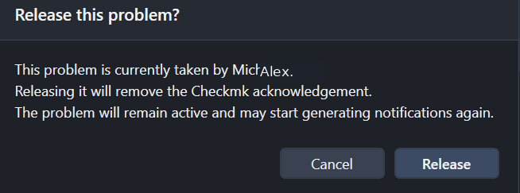
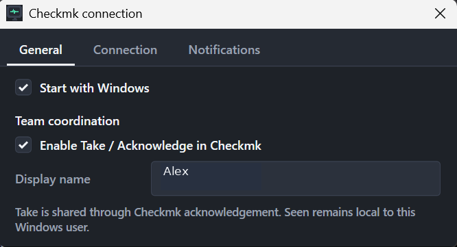
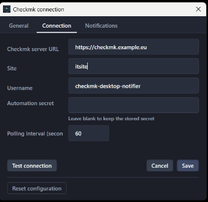
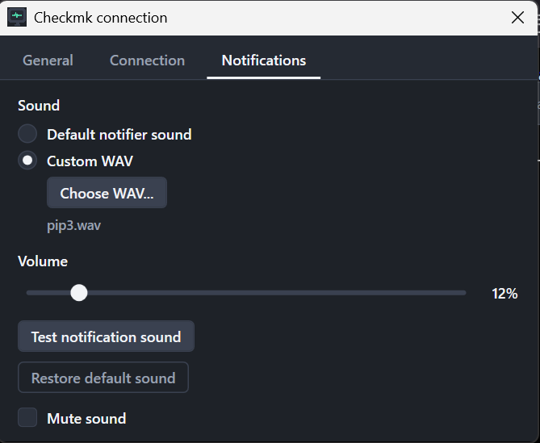
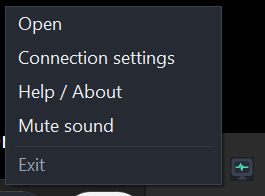

# Checkmk Desktop Notifier

**[English](README.md)** | **[Polski](README.pl.md)**

A lightweight Windows desktop monitor and notifier for Checkmk.

This is an **independent open-source project**. It is **not affiliated with Checkmk GmbH**, and is not endorsed by or a product of Checkmk GmbH. “Checkmk” is used only to name the monitoring system this companion talks to.

Current version: **1.2.0** (FEATURE COMPLETE / RELEASE CANDIDATE — Phase 6A Take, Phase 6B Open in Checkmk + Seen/Unseen, and Phase 7A Release / Untake, all COMPLETE / Windows-tested). This is the consolidated public-release candidate. Tag `v1.1.0` is unchanged; a GitHub Release was not published for 1.1.0.

## Overview

Checkmk Desktop Notifier is a per-user Windows 10/11 companion. It polls Checkmk over the REST API, shows current HARD host and service problems in a compact Always-on-Top bar, and raises desktop notifications when new local incidents open.

It is **not** a replacement for the Checkmk web UI. Local **Seen** state lives on this Windows user only. Optional **Take** writes a sticky acknowledgement in Checkmk so other administrators can see that the problem is being handled. **Release** on a CDN Take removes that Checkmk acknowledgement. Generic/manual acknowledgements are not removed by the notifier.

## Screenshots

Host names and internal URLs are omitted or replaced with examples.

















## Features

- Compact Always-on-Top bar with NEW / CRIT / WARN / UNKNOWN / TAKEN counts
- Expandable problem list (hosts and services, plugin output, EN/PL UI)
- Clickable counters and filter chips ALL / NEW / CRIT / WARN / UNK / TAKEN (presentation-only; incidents are not merged)
- Live search above the problem list (host, service, Taken-by name; combines with the active filter)
- Local NEW / Seen (per Windows user, persisted; reversible Unseen)
- Open the corresponding host or service in the Checkmk GUI (default browser; does not change incident state)
- Optional Take / shared sticky Checkmk ACK (disabled by default)
- Checkmk ACK badge (generic ACK vs Taken by display name)
- Scheduled-downtime badges
- Background polling of Checkmk service and host REST collections
- Windows balloon notifications and alert sound
- Bundled WAV, optional custom WAV, per-app volume, mute
- HOST DOWN / UNREACHABLE notification grouping (notifications only)
- System tray (show / hide / Settings / About / Mute / Exit)
- Start with Windows (per-user HKCU Run)
- GUI Settings; automation secret in Windows Credential Manager
- Per-user installer (no Administrator rights)
- Single-instance: a second launch activates the existing notifier
- Self-contained portable win-x64 publish remains supported

## Requirements

**Windows**

- Windows 10 or Windows 11 (64-bit)
- No Administrator rights for install or normal use
- Network path to the Checkmk server (for example a VPN, if that is how you reach the site)

**Checkmk**

- Verified against **Checkmk CRE / RAW 2.4.0p34** REST API 1.0
- Other editions/versions that expose the same service POST and host GET collections may work; they are not claimed as tested
- An automation user that can **read** the hosts and services you care about (see [Checkmk automation user](#checkmk-automation-user))
- Optional Take also needs Checkmk permission **`action.acknowledge`** (not Administrator)

## Installation

Recommended for normal use: the per-user installer `CheckmkDesktopNotifier-Setup-x64.exe` from a GitHub Release.

- Runs as a **normal Windows user**. No Administrator / UAC elevation.
- Installs to `%LocalAppData%\Programs\CheckmkDesktopNotifier`
- Always creates a **Start Menu** shortcut
- Optional **desktop shortcut** (off by default)
- Optional **Start with Windows** (same HKCU Run value as Settings → General)
- Does **not** require `checkmk.local.json`, `CHECKMK_CONFIG`, or environment variables

The installer and the application share one autostart mechanism:

`HKCU\Software\Microsoft\Windows\CurrentVersion\Run`  
value name: `CheckmkDesktopNotifier`  
command: quoted path to `CheckmkDesktopNotifier.exe`

There is no Startup-folder shortcut, scheduled task, or HKLM entry for this option.

Verify the installer hash against [SHA256SUMS.txt](SHA256SUMS.txt) before running it.

### Unsigned installer / SmartScreen

V1 binaries are **unsigned**. Windows SmartScreen may show an “unknown publisher” warning. That warning means the file is not Authenticode-signed; it does **not** by itself mean the file is malicious. Download only from this repository’s official source, and verify the SHA-256 in [SHA256SUMS.txt](SHA256SUMS.txt). Do **not** disable SmartScreen globally.

## First run / configuration

1. Start **Checkmk Desktop Notifier** from the Start Menu.
2. Open **Settings** (gear on the compact bar, or tray → Connection settings).
3. On the **Connection** tab, enter:

   | Field | Meaning |
   |-------|---------|
   | Checkmk server URL | Origin only, for example `https://checkmk.example.com` — no site path, no credentials |
   | Site | Checkmk site name, for example `mysite` |
   | Username | Automation user name |
   | Automation secret | Automation secret (stored in Credential Manager, not in `settings.json`) |
   | Polling interval | Seconds between polls (default 60, minimum 10) |

4. Click **Test connection**. The app checks that both the service and host REST collections are reachable.
5. Click **Save**. Monitoring starts with an immediate first poll.

The installed application does **not** need `config/checkmk.local.json`, `CHECKMK_CONFIG`, or `CHECKMK_*` environment variables. Those remain **developer / CI overrides** only.

On a **first successful poll** with empty local incident state, current problems are loaded silently (no notification storm). Later polls notify only newly opened local incidents.

## Checkmk automation user

Create an **automation user** with an **automation secret** (not an interactive password login).

Working model:

- Role: **Normal monitoring user** is sufficient for the monitored scope (verified for reads)
- Contact-group membership must include the hosts and services you want to see
- Checkmk Administrator rights are **not** required
- Optional Take requires **`action.acknowledge`**. Leave Take disabled if the account is read-only; monitoring continues
- A narrower “read these two collections only” role was **not** tested

Do not put a real username, secret, URL, or internal group name in this repository.

## Seen vs Take vs ACK

**NEW / Seen** is **local, per Windows user**:

- The eye button marks **that** incident Seen
- On a Seen row, the same eye marks it **Unseen** and returns it to NEW immediately
- Mark unseen does **not** replay balloon or sound
- **Mark all new as seen** marks every currently NEW incident (there is no bulk Unseen)
- Seen is stored on disk and **survives restart**
- Seen is **not** sent to Checkmk
- Seen is **not** shared with other administrators or other Windows users

A compact **Open in Checkmk** icon opens the corresponding host or service **GUI view** in the default browser (not a REST API resource). Service rows open that service; host rows open that host. It does not change Seen, Take, ACK, or downtime.

**Take** is a **shared** team action (Settings → General, off by default):

- Creates a sticky Checkmk acknowledgement for that host or that service only (`sticky=true`, `persistent=false`, `notify=false`)
- Does not hide the problem, change severity, mark it Seen, ACK child services, or create a ticket
- Checkmk stops further notifications for the current problem until it returns to OK/UP
- After confirm, the row shows **Taking...** until Checkmk read-back confirms **Taken by &lt;display name&gt;**. There is no optimistic Taken state and no native Windows MessageBox
- Multiple notifier instances see the same Taken state after polling (Checkmk is the source of truth)

Click **Taken by &lt;name&gt;** to **Release** a CDN Take (any administrator using the notifier, not only the person who took it):

- Release deletes that Checkmk acknowledgement (`POST /domain-types/acknowledge/actions/delete/invoke`) after a fresh Checkmk read when practical
- Allowed **only** for notifier-created CDN Takes. A generic/manual Checkmk ACK stays a non-clickable **ACK** badge and is never deleted
- The row shows **Releasing...** until Checkmk reports no ACK, then the normal **Take** action returns. No optimistic Released state
- Release does **not** resolve the Checkmk problem. Severity stays CRIT/WARN/UNKNOWN until Checkmk reports recovery. Checkmk itself may start sending notifications again
- Release does not change local Seen/Unseen and does not raise a notifier balloon or sound
- ACK also ends on recovery to OK/UP

**Taken by** is shown only when the ACK comment was created by Checkmk Desktop Notifier (`cdn.v1 take name="..."`). A manual Checkmk ACK shows **ACK**, not a guessed person. The Checkmk comment author is the shared automation account and is never used as identity. Take comments are **single-line** (`Taken by {name} via Checkmk Desktop Notifier cdn.v1 take name="..."`) because Checkmk RAW 2.4 truncates multiline ACK comments.

Display name is stored in `preferences.json` (not Credential Manager).

## Notifications

A Windows balloon (via the tray icon) and, unless muted, one alert sound are emitted when a local incident **opens** (`AlertDelta.Opened`) after host-failure grouping.

- Later polls of the same uninterrupted incident do not repeat the balloon/sound
- Restart does not replay already-open incidents
- A failed poll never looks like “everything recovered” and does not emit recovery noise
- Mute turns **sound** off; balloons still appear
- If a NEW incident is **already acknowledged** in Checkmk when it opens, it stays locally NEW but produces **no balloon and no sound**
- ACK appearing later on an already-open incident does not create a new notification
- Take and Release do **not** emit a balloon or sound by themselves
- Scheduled downtime does **not** suppress balloons (unchanged)

## Checkmk ACK and downtime

- Optional **Take** writes a sticky Checkmk ACK for that object only (see [Seen vs Take vs ACK](#seen-vs-take-vs-ack))
- A Checkmk ACK from the GUI or another tool shows as **ACK**, not Taken by
- **Scheduled downtime** is **read-only** metadata. This notifier does not schedule or remove downtime
- ACK is **not** Seen. Marking Seen does **not** ACK in Checkmk

## Host DOWN / UNREACHABLE grouping

Grouping affects **notifications only**. Incidents are **not** merged in the engine or in the problem list.

If a HARD **DOWN** (Critical) or **UNREACHABLE** (Unknown) host has affected child services in the same snapshot:

- One grouped host balloon and one sound are emitted (`HOST DOWN` / `HOST UNREACHABLE` plus an affected-service count)
- Child service incidents stay fully visible and keep their own NEW/Seen
- Child service balloons/sounds are suppressed while that host grouping is active
- Later polls while the host stays failed do not repeat the grouped balloon
- This avoids a service-notification storm when a host fails

ACK on the grouping host suppresses the grouped balloon/sound. Child incidents stay visible and keep local NEW/Seen; they are not auto-ACK’d. Downtime does **not** suppress the grouped balloon.

## Tray behavior

The app keeps a system tray icon.

- Closing the compact bar **hides** it (does not exit)
- Tray **Open** or left-click restores/toggles the existing bar
- Tray / gear share Settings, About, Mute, Hide, and **Exit**
- **Exit** is the only normal way to stop polling

A second start of the installed or portable exe **activates** the existing instance. It does not start a second poller.

## Start with Windows

Settings → **General** → **Start with Windows**, or the installer checkbox, write the same HKCU Run value described under [Installation](#installation). The checkbox shows the **real** OS entry, not a preference file. No elevation.

## Notification sound / custom WAV / volume / mute

- Bundled original WAV (`notifier.wav`, short synthetic motif)
- Settings → **Notifications**: Default vs **Custom WAV**, volume **0–100%** (default 30%), Mute, **Test notification sound**, Restore default
- V1 accepts **WAV only** (uncompressed PCM). MP3/MP4 are intentionally unsupported
- A custom file is **copied** into `%LocalAppData%\CheckmkDesktopNotifier\assets\custom-notification.wav`. Deleting the original source file does not break playback
- Mute disables audio only; visual balloons still appear
- Test plays the selected sound at the configured volume and **bypasses Mute** so you can preview while muted
- Volume is in-process PCM scaling. The app does not change Windows master volume

## Security / Credential Manager

| Data | Location |
|------|----------|
| Non-secret GUI settings (URL, site, username, poll interval) | `%LocalAppData%\CheckmkDesktopNotifier\settings.json` |
| Automation secret | Windows Credential Manager, Generic Credential **`CheckmkDesktopNotifier`** (this Windows user) |
| Incidents / Seen | `%LocalAppData%\CheckmkDesktopNotifier\state\<connection-hash>\alert-state.json` |
| Mute / volume / Default vs Custom / Take / display name | `%LocalAppData%\CheckmkDesktopNotifier\preferences.json` |
| Imported custom WAV | `%LocalAppData%\CheckmkDesktopNotifier\assets\custom-notification.wav` |

- The secret is **not** stored in `settings.json` or `alert-state.json`
- Authorization headers are **not** persisted
- No Administrator rights are required
- Credential Manager is the OS secret store for this Windows user. It is **not** application-layer encryption and is not a substitute for a hardware token or enterprise secret vault

Reset configuration removes GUI settings and the stored secret. It does **not** delete incident/Seen files or notification preferences.

## Upgrade

Run a newer `CheckmkDesktopNotifier-Setup-x64.exe` over the existing per-user install.

- Replaces program files under `%LocalAppData%\Programs\CheckmkDesktopNotifier`
- Keeps user data under `%LocalAppData%\CheckmkDesktopNotifier`
- Does **not** remove the Credential Manager secret
- If the app is running, Setup asks you to **Exit** from the tray (no silent kill)

## Uninstall

Use Windows **Apps** / installed-app uninstall, or the uninstaller from the install folder.

- Removes binaries, Start Menu / desktop shortcuts, and the HKCU Run value
- **By default keeps** user data (settings, Seen, preferences, custom WAV)
- Optional prompt (default **No**) can delete the LocalAppData app folder and attempt `cmdkey /delete:CheckmkDesktopNotifier`

## Portable mode

Self-contained **win-x64** publish remains supported (`publish/win-x64/CheckmkDesktopNotifier.exe`).

| | Installed | Portable |
|---|-----------|----------|
| Typical use | Normal deployment | Testing, development, manual copy |
| Location | `%LocalAppData%\Programs\CheckmkDesktopNotifier` | Folder you publish to |
| Settings / Seen / secret | Same LocalAppData + Credential Manager | Same LocalAppData + Credential Manager |

Portable and installed builds share the per-user single-instance mutex and the same user-data directory for this Windows user.

## Building from source

Prerequisites: **.NET 8 SDK**.

The WPF app targets `net8.0-windows`. Linux CI can **compile** it (`EnableWindowsTargeting`); you still need Windows to **run** the UI.

```bash
dotnet build CheckmkDesktopNotifier.sln
dotnet test CheckmkDesktopNotifier.sln
```

Portable publish:

```bash
dotnet publish src/CheckmkDesktopNotifier.App/CheckmkDesktopNotifier.App.csproj \
  -c Release \
  -r win-x64 \
  --self-contained true \
  -p:PublishSingleFile=false \
  -o publish/win-x64
```

`publish/` is gitignored. Do not commit publish output.

## Building the installer

On **Windows**, with [Inno Setup 6](https://jrsoftware.org/isinfo.php) installed:

```powershell
powershell -File scripts/build-windows-package.ps1
```

Output (gitignored):

```text
artifacts\CheckmkDesktopNotifier-Setup-x64.exe
```

The script reads version from `Directory.Build.props` (currently **1.2.0**) and passes `/DMyAppVersion` to `iscc`. Equivalent:

```text
iscc /DMyAppVersion=1.2.0 installer\CheckmkDesktopNotifier.iss
```

SHA-256 of a built installer (do not invent a hash before the file exists):

```powershell
powershell -File scripts/hash-windows-installer.ps1
```

or:

```powershell
Get-FileHash .\artifacts\CheckmkDesktopNotifier-Setup-x64.exe -Algorithm SHA256
```

Inno Setup itself is **not** committed. Only `installer/CheckmkDesktopNotifier.iss` is source.

## Current limitations

These are **intentional V1 boundaries**, not accidental omissions:

- Windows only
- Checkmk-specific (REST collections as documented in `docs/CHECKMK_API.md`)
- Local Seen is **not** shared between administrators
- Optional Take writes sticky Checkmk ACK; **Release** removes a CDN Take only (never a generic/manual ACK)
- No ticketing / Zoho integration
- No custom shared backend/database
- Custom alert sounds are **WAV-only**
- Notifications use tray **balloons**, not packaged Windows App SDK toasts
- Builds are **unsigned**; SmartScreen may warn
- Compact-bar position is not persisted across restart
- No in-app language switcher (UI follows Windows UI culture: English default, Polish when the UI culture is Polish)

## Roadmap

**1.1.0 (tagged, not published as a GitHub Release):** Team Take / shared sticky Checkmk ACK, Taken by, TAKEN filter/counter, search, ACK-aware notification suppression, Open in Checkmk, reversible local Seen/Unseen. CDN comments are single-line because Checkmk RAW 2.4 truncates multiline ACK comments.

**1.2.0 (FEATURE COMPLETE / RELEASE CANDIDATE):** Consolidated team workflow. Safe Release / Untake of CDN Takes (`POST /domain-types/acknowledge/actions/delete/invoke`), dark Take/Release confirmation, row waiting states instead of native MessageBoxes, Checkmk remaining source of truth. Phase 6A, 6B, and 7A are COMPLETE / Windows-tested. See [docs/RELEASE_NOTES_1.2.0.md](docs/RELEASE_NOTES_1.2.0.md).

**Future / optional:**

- Ticket workflow / Zoho Desk integration

This project will **not** add a custom shared database for team workflow. Ticketing remains future work.

**Possible later improvements**

- Modern Windows toast notifications if the packaging / identity model changes
- Additional notification audio formats if there is a clear need

## License / attribution

- License: [MIT](LICENSE) — Copyright © 2026 TimeWizard007
- Application icon: original project placeholder (dark monitor + heartbeat). **No Checkmk logo** is bundled
- Default notification sound: original / generated WAV in-tree
- NuGet: CommunityToolkit.Mvvm and Microsoft.Extensions.* (MIT)
- Installer compiled with Inno Setup 6 (compiler not shipped in this repo)

Checkmk® is a trademark of Checkmk GmbH. This project is independent and uses the name only to describe compatibility.
